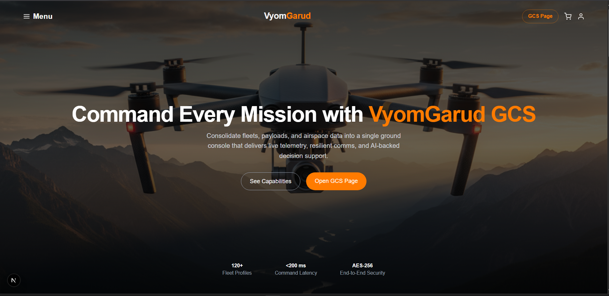
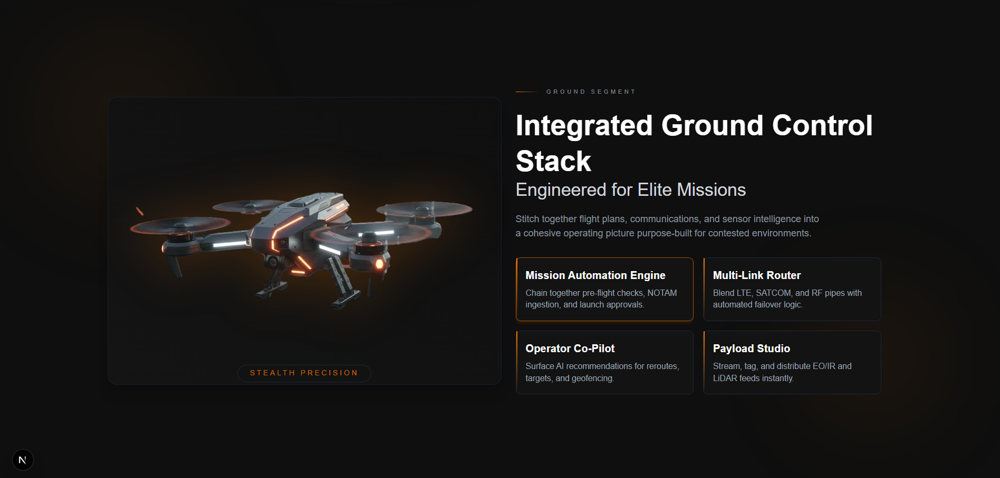
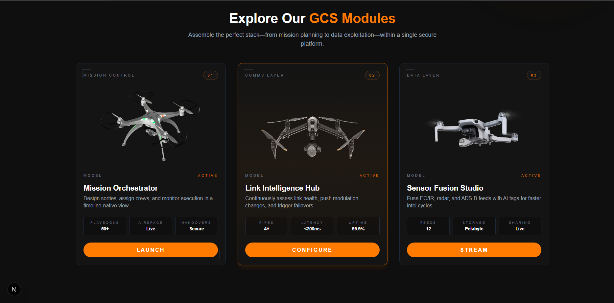
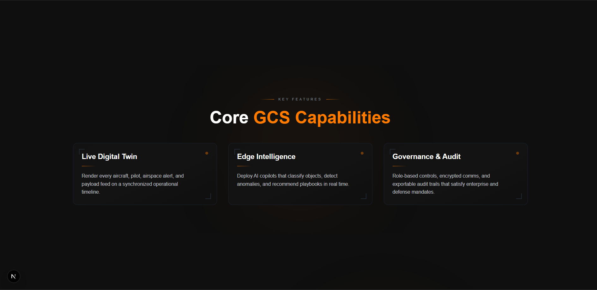
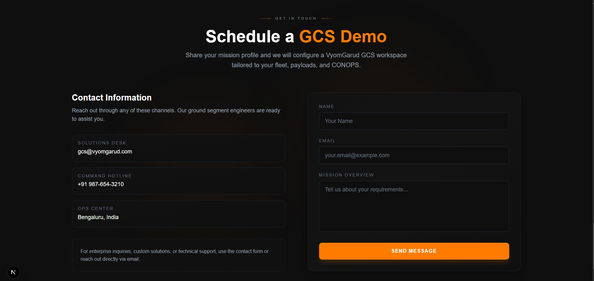
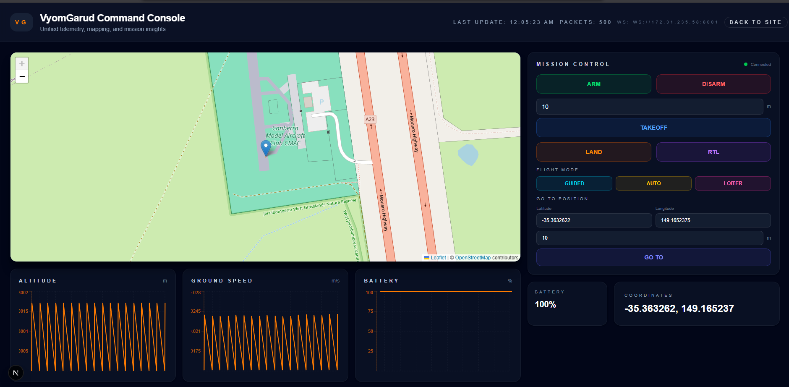

<div align="center">


# VyomGarud Platform

A comprehensive UAV (Unmanned Aerial Vehicle) platform featuring a high-impact marketing landing page and a real-time Ground Control Station (GCS) console for mission management and telemetry monitoring.

</div>

---

## ✨ Features

### Landing Page
- **Immersive hero experience** with animated CTAs, quick stats, and an overlayed background image
- **Left-drawer navigation** powered by Framer Motion, complete with full-screen dimmer and smooth scroll-to-section behavior
- **Mission-focused storytelling** in `About`, `Highlights`, and `Products` sections using animated cards, gradient glows, and responsive grids
- **Product showcase grid** that highlights three flagship drones with specs, imagery, and motion-enhanced hover states
- **Contact funnel** featuring animated contact info cards, a responsive form with submission state, and animated CTA
- **Global styling** with Tailwind CSS, custom font stack, gradient overlays, and reusable color palette (`#0f0f0f` + VyomGarud accent `#ff7b00`)

### Ground Control Station (GCS) Console
- **Real-time telemetry streaming** via WebSocket connection to MAVLink-compatible autopilots
- **Interactive map view** with live drone tracking, flight path visualization, and automatic map centering
- **Mission control panel** with ARM/DISARM, TAKEOFF, LAND, RTL (Return to Launch) commands
- **Flight mode switching** (GUIDED, AUTO, LOITER) with visual indicators
- **Go-to GPS position** functionality with latitude, longitude, and altitude inputs
- **Real-time telemetry charts** displaying altitude, ground speed, and battery levels with smooth linear visualization
- **Telemetry panels** showing battery status, GPS coordinates, and raw telemetry data
- **Full-width console** with dark military/futuristic theme and orange accent colors
- **Robust error handling** for non-JSON WebSocket messages and connection management

## 🧱 Tech Stack

| Layer        | Details |
|--------------|---------|
| Framework    | [Next.js 16 (App Router)](https://nextjs.org/) |
| Language     | TypeScript / JSX |
| Styling      | [Tailwind CSS](https://tailwindcss.com/) configured in `app/globals.css` |
| Animation    | [Framer Motion](https://www.framer.com/motion/) for section reveals, sidebar transitions, and button interactions |
| Mapping      | [Leaflet](https://leafletjs.com/) + [React Leaflet](https://react-leaflet.js.org/) for interactive maps |
| Charts       | [Recharts](https://recharts.org/) for real-time telemetry visualization |
| Icons        | [React Icons](https://react-icons.github.io/react-icons/) (`Feather` subset) |
| Communication| WebSocket for real-time MAVLink telemetry streaming |
| Images       | Optimized with `next/image` using local assets in `public/` |

## 📂 Project Structure

```
app/
├─ components/
│  ├─ Hero.tsx              // Landing page hero, sidebar menu, CTA buttons, key stats
│  ├─ About.tsx              // Mission overview cards with animated accents
│  ├─ Products.tsx           // Performance feature list + product grid
│  ├─ Highlights.tsx         // Key differentiators with hover glows
│  ├─ Contact.tsx            // Contact info + animated form
│  ├─ Footer.tsx             // Minimal branded footer
│  ├─ MapView.tsx            // Real-time map with drone tracking and flight path
│  ├─ Charts.tsx            // Telemetry charts (altitude, speed, battery)
│  ├─ Panels.tsx             // Telemetry data panels (battery, coordinates)
│  ├─ CommandControl.tsx     // Mission control panel (ARM, TAKEOFF, LAND, etc.)
│  └─ Drone3D.tsx            // 3D drone visualization with attitude display
├─ gcs/
│  └─ page.tsx               // Ground Control Station console page
├─ globals.css               // Tailwind base styles, font imports
├─ layout.tsx                // HTML shell with site-wide typography + colors
└─ page.tsx                  // Landing page composition ordering all sections

src/
└─ lib/
   ├─ useTelemetry.ts        // WebSocket telemetry hook with MAVLink message parsing
   └─ fixLeafletIcon.ts      // Leaflet icon configuration fix
```

All sections are self-contained client components (`"use client";`) to enable Framer Motion animations, WebSocket connections, and interactive behaviors.

## 🚀 Getting Started

### Prerequisites
- Node.js 18+ and npm
- A MAVLink-compatible autopilot (ArduPilot, PX4) or simulator (SITL)
- WebSocket bridge server for MAVLink telemetry (see Backend Integration)

### Installation

```bash
# Install dependencies
npm install

# Start development server
npm run dev
```

Then open:
- **Landing Page**: [http://localhost:3000](http://localhost:3000)
- **GCS Console**: [http://localhost:3000/gcs](http://localhost:3000/gcs)

### Environment Variables

Create a `.env.local` file in the root directory:

```env
NEXT_PUBLIC_WS_URL=ws://localhost:8001
```

This sets the WebSocket URL for the telemetry stream. Defaults to `ws://localhost:8001` if not set.

## 🔌 Backend Integration

The GCS console connects to a WebSocket server that bridges MAVLink telemetry. The server should:

1. **Connect to MAVLink** (via UDP, serial, or TCP)
2. **Stream telemetry** as JSON messages over WebSocket
3. **Handle commands** sent from the GCS console

Example message format:
```json
{
  "type": "GLOBAL_POSITION_INT",
  "lat": 353632620,
  "lon": 1491652370,
  "alt": 10000,
  "relative_alt": 10000
}
```

Command format:
```json
{
  "cmd": {
    "type": "ARM",
    "mode": "GUIDED",
    "alt": 10,
    "lat": -35.363262,
    "lon": 149.165237
  }
}
```

## 🎮 GCS Console Features

### Mission Control
- **ARM/DISARM**: Arm or disarm the vehicle
- **TAKEOFF**: Take off to specified altitude (1-100m)
- **LAND**: Land at current position
- **RTL**: Return to launch position
- **Mode Switching**: Switch between GUIDED, AUTO, and LOITER modes
- **Go To Position**: Navigate to specific GPS coordinates with altitude

### Telemetry Visualization
- **Real-time Map**: Interactive map showing drone position, flight path, and waypoints
- **Telemetry Charts**: Live charts for altitude, ground speed, and battery percentage
- **Data Panels**: Battery status, GPS coordinates, and raw telemetry console

### Data Handling
- **Automatic field merging**: Preserves telemetry fields across different message types
- **Robust JSON parsing**: Handles non-JSON messages gracefully
- **Connection management**: Automatic reconnection and error handling
- **Data buffering**: Maintains history of up to 500 telemetry points

## 🧪 Development Notes

- **Framer Motion** `viewport={{ once: true }}` settings ensure reveal animations play the first time a section enters the viewport
- **Smooth scrolling** is handled via `handleScroll` helper inside `Hero.tsx`
- **Static assets** live under `public/`, allowing `next/image` to optimize them automatically
- **Leaflet maps** are dynamically imported to avoid SSR issues
- **WebSocket connections** are managed per component with proper cleanup
- **Tailwind classes** drive the majority of layout/styling. Adjust global tokens (colors, fonts) in `globals.css` for brand updates

## 🖼️ Screenshots

<div align="center">
  
  <br />
  
  <br />
  
  <br />
  
  <br />
  
  <br />
  
  <br />
  
</div>

## 📦 Deployment

This project can be deployed to platforms that support Next.js (Vercel, Netlify, etc.). Build with:

```bash
npm run build
npm run start # preview production build locally
```

**Note**: For the GCS console to work in production, ensure your WebSocket server is accessible and update `NEXT_PUBLIC_WS_URL` accordingly.

## 🔒 Security Considerations

- WebSocket connections should use WSS (secure WebSocket) in production
- Implement authentication/authorization for command endpoints
- Validate and sanitize all user inputs before sending commands
- Consider rate limiting for command execution

## 📄 License

This project is distributed for demonstration purposes. Adapt licensing info here to match your organization's policy.

## 🤝 Contributing

Contributions are welcome! Please feel free to submit a Pull Request.

---

